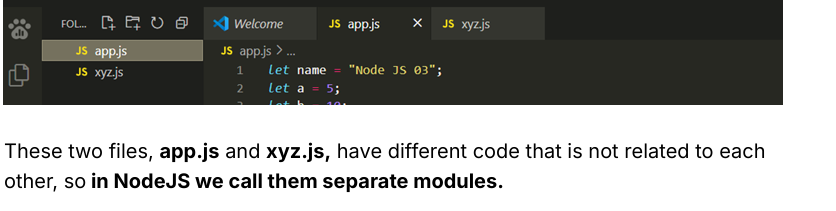

# module.export & require

- Keeping all the nodeJS code in a single file is not a good practise, so make separate logical files.
- These logical separate files created is known as modules. The codes written in them are not logically related to each other.
  

## How to make two modules work together?

- Using a `require function`.

## What is the require function?

- In Node.js, the `require()` function is a built-in function that allows you to include or require other modules into your main modules. Now, let's write our code using the require function.

  - **Task:** Our objective is to execute the code written in the the app.js module.

## If I write a function in another module, can I use that function in a different module? Will it work or not?

*Ans* It will not Work.
  - Modules protect their variables and functions from leaking by default.

  
